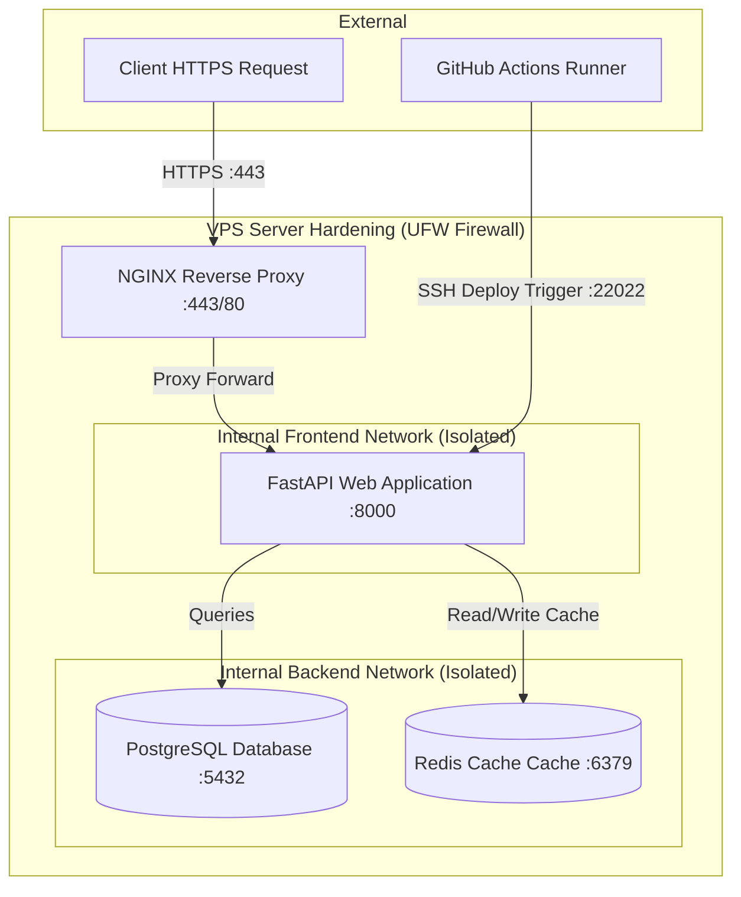

# ForgeDeploy FastAPI: Production-Grade Containerized Backend Infrastructure

A highly secure, highly reliable, and production-ready containerized backend deployment stack for a FastAPI application running on a Linux VPS. 

Featuring automated Let's Encrypt SSL orchestration, secure database backup pipelines, microservice network isolation, structured analytic logs, and zero-downtime GitHub Actions CI/CD workflows.

---

## Architectural Overview



### Key Architectural Highlights:
* **Proxy and SSL Termination**: NGINX intercepts all public traffic, terminates SSL, enforces modern TLS 1.2/1.3 profiles, injects production security headers, and applies gzip compression.
* **Network Isolation (Defense in Depth)**: Custom Docker bridge subnets isolate services. NGINX has no networking capability to reach PostgreSQL or Redis, protecting data from potential front-end breaches.
* **Decoupled Configuration**: Pydantic Settings reads and validates system environments. Secrets are strictly injected through Docker Compose and stored in secure VPS settings or GitHub Secrets.
* **Structured Logging Analytics**: Custom middleware formats requests to single-line JSON streams on stdout, combining log flows via a unified `X-Request-ID` across NGINX and FastAPI.

---

## Repository Structure

```
forgedeploy-fastapi/
├── .github/
│   └── workflows/
│       └── ci-cd.yml           # GitHub Actions pipeline (Lint, Test, Build, Push, SSH Deploy)
├── app/
│   ├── __init__.py
│   ├── main.py                 # FastAPI bootstrap, lifespans, CORS & middleware mounts
│   ├── config.py               # Pydantic Settings environment parser
│   ├── database.py             # Async SQLAlchemy connection and session injector
│   ├── redis_client.py         # Async Redis connection pool singleton
│   ├── routers/
│   │   ├── health.py           # Deep dependency health check (Postgres & Redis)
│   │   └── items.py            # Items REST API with automatic Redis caching
│   ├── middleware/
│   │   └── logging.py          # Structured request JSON logger middleware
│   └── tests/
│       ├── conftest.py         # Testing loop scopes
│       └── test_main.py        # Integration and endpoint test suites
├── docker/
│   ├── nginx/
│   │   ├── nginx.conf          # NGINX system-level performance config
│   │   └── conf.d/
│   │       └── default.conf    # Proxy routes, caching, and SSL blocks
├── scripts/
│   ├── backup.sh               # Daily compressed pg_dump database cron utility
│   ├── restore.sh              # Gzip restoration database recovery tool
│   ├── deploy.sh               # Local zero/minimal-downtime swap and health polling deploy tool
│   └── init-ssl.sh             # Fallback cert generation and Certbot solver bootstrap
├── .dockerignore               # Optimized Docker context exclusion list
├── .env.example                # Deployment environment template
├── Dockerfile                  # Secure, multi-stage, non-root Python runtime builder
├── docker-compose.yml          # Network isolated service configuration
├── pyproject.toml              # Project dependencies configuration
└── security_hardening.md       # VPS OS Hardening setup playbook
```

---

## Local Verification and Testing

### 1. Prerequisite Installations
Ensure you have Docker and Docker Compose v2+ installed locally.

### 2. Configure Environment Settings
Copy the env template file and modify placeholder credentials:
```bash
cp .env.example .env
```

### 3. Execute Pytest Testing Suite
Tests can be executed locally inside a temporary build container or via local python virtual environments:
```bash
# Set dummy environment keys and execute tests
pytest app/tests/
```

### 4. Build and Launch Infrastructure Services
```bash
# Build the FastAPI image and launch the full stack locally
docker compose up -d --build
```
NGINX will boot up utilizing self-signed SSL certificate placeholders. You can access the API via:
* **Root Portal**: `https://localhost/`
* **Dependency Health Checks**: `https://localhost/health`
* **Swagger/OpenAPI Documentation**: `https://localhost/docs` (if ENVIRONMENT != "production")

---

## Step-by-Step VPS Provisioning and Deployment

Follow this runbook to productionize the backend stack on your clean Ubuntu VPS:

### Step 1: Execute Server OS Hardening
Log in to your VPS as root and execute the steps documented in the **[security_hardening.md](file:///c:/Users/DELL/Desktop/forgedeploy-fastapi/security_hardening.md)** file:
1. Configure UFW firewall allowing ports `80`, `443`, and custom SSH.
2. Hardened SSH daemon (`/etc/ssh/sshd_config`) and disable passwords.
3. Install and run Fail2Ban.
4. Set up the restricted deployment user `deployuser` and include them in the `docker` group.

### Step 2: Clone and Setup Workspace
As `deployuser`, clone your repository into the target deploy directory:
```bash
mkdir -p /home/deployuser/forgedeploy-fastapi
cd /home/deployuser/forgedeploy-fastapi
git clone <your-repo-url> .
```

### Step 3: Populate Secure Environmental Configurations
Create the production `.env` file:
```bash
cp .env.example .env
nano .env
```
Fill out production credentials, set `ENVIRONMENT=production`, `USE_SSL=true`, and fill in your registered `DOMAIN` (e.g. `api.example.com`) and `SSL_EMAIL`.

### Step 4: Bootstrapping SSL Certificates
Run the automated SSL bootstrapping utility to generate fallback certs, boot NGINX, and provision secure Let's Encrypt certificates:
```bash
chmod +x scripts/*.sh
./scripts/init-ssl.sh
```

The script solves the ACME validation challenge, saves the certificates in named Docker volumes, replaces the self-signed placeholders, and reloads NGINX.

### Step 5: Configure Automatic SSL Renewal
Let's Encrypt certificates expire every 90 days. Set up a simple bi-weekly cron job on the host system to run renewals:
```bash
sudo crontab -e
```
Add the following line to evaluate and execute silent certificate renewals at 03:00 AM every Sunday:
```cron
0 3 * * 0 docker run --rm -v "nginx_prod_certs:/etc/letsencrypt" -v "certbot_prod_webroot:/var/www/certbot" certbot/certbot renew --quiet && docker compose -f /home/deployuser/forgedeploy-fastapi/docker-compose.yml exec -T nginx nginx -s reload
```

---

## Backup and Restoration Management

### 1. Database Automated Backups
To schedule automatic nightly database backups, register the backup script in the host crontab:
```bash
crontab -e
```
Add the following job to execute compressed SQL exports daily at 02:00 AM:
```cron
0 2 * * * /home/deployuser/forgedeploy-fastapi/scripts/backup.sh >> /home/deployuser/forgedeploy-fastapi/backups/cron.log 2>&1
```

### 2. Database Recovery Process
In the event of a system recovery or migration, restore backups securely:
```bash
# Provide path to the gzipped database archive file
./scripts/restore.sh backups/db_backup_20260526_020000.sql.gz
```
The restoration pipeline checks active connection states, prompts the operator for explicit "yes" confirmation, uncompresses the streams directly into psql, and invalidates all Redis caches to ensure no stale data lies inside API clients.

---

## Logging, Monitoring, and Auto-Recovery

### 1. Log Management
Container streams write structured JSON straight to stdout/stderr.
* To review live production API logs: `docker compose logs -f fastapi`
* To review live reverse-proxy traffic: `docker compose logs -f nginx`

### 2. Container Auto-Recovery
Our service infrastructure configures `restart: always` for all items.
* If a memory leak or crash occurs in FastAPI, Docker daemon catches the code fault and restarts the service in under 2 seconds.
* Dependency chains are fully ordered: if a physical VPS reboot occurs, PostgreSQL and Redis boot up first and reach a `healthy` state before the FastAPI application is allowed to bind its ports, preventing database link failures.

---

## GitHub Actions CI/CD Integration

The pipeline leverages GitHub repository secrets to validate, build, and deploy changes securely.

### Configure GitHub Repository Secrets
Go to your **GitHub Repository Settings -> Secrets and variables -> Actions** and create the following credentials:
* `VPS_HOST`: The public IP address of your remote VPS server.
* `VPS_USER`: Set to `deployuser`.
* `SSH_PRIVATE_KEY`: Paste the raw private SSH key whose matching public key is inside `/home/deployuser/.ssh/authorized_keys`.
* `VPS_SSH_PORT`: Set to your hardened custom SSH port (e.g. `22022`).

### Automated Deployment Cycle
Upon pushing code changes to your `main` branch:
1. GitHub runner spins up python, runs `ruff` syntax checks, and executes `pytest` tests.
2. Builds the optimized multi-stage Docker image, utilizing action caching engines for super fast builds.
3. Pushes the image to GHCR (GitHub Container Registry) tagged with the unique Git SHA.
4. SSHs securely into your VPS.
5. Performs a clean Git pull and executes `./scripts/deploy.sh`.
6. `./scripts/deploy.sh` pulls the latest image, initiates a zero-downtime swap, loops checking `/health` inside NGINX networks, reloads proxy routers on success, or rolls back to the previous stable release container if the new deployment fails its health check.
